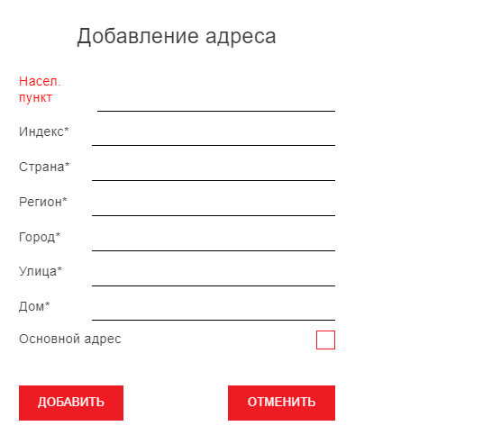

# testRazional
test tasks for Razional company

## Task 1
Создать форму с несколькими полями.

1.	Первое поле имеет тип числовой. 
2.	Второе поле зависит от первого поля. Должно быть видимое только в случае ввода значения в первом поле. Должно содержать перечисление от 1 до 100. 
3.	Третье поле зависит от второго. Поле доступно к изменению только в случае выбора второго поля, но видимое всегда. Должно содержать выбор всех элементов произведения значения первого поля на каждый элемент второго поля; 
4.	Четвертое поле содержит склеенное значение первых трёх полей в текстовом формате. Должно становиться синим цветом в случае, если результат является чётным. И Красным, если не чётное.
5.	Пятое поле должно содержать остаток от деления значения четвертого поля, преобразованного в число, на число из первого поля. Должно быть всегда неактивным.

Форма должна содержать 5 кнопок:
1.	Должна сбрасывать все поля в начальное состояние по умолчанию;
2.	Должна выводить в div текстовое значение всех полей;
3.	Записать в div SQL запрос, который будет записывать эти данные в гипотетическую SQL таблицу;
4.	Заполняет поля формы значениями из последней строки гипотетической SQL таблицы;
5.	Автоматически заполняет поля формы произвольными значениями;

Форма должна содержать таблицу, в которую выводятся все значения SQL таблицы.

## Task 2
Сверстать форму, примерный макет:
 
Важно соблюдать семантику. Стилизацию можно сделать примерную. 
Со стороны JS настроить асинхронную отправку запроса на сервер, формат запроса JSON.

Со стороны сервера: написать небольшой скрипт PHP для обработки запроса и записи ответа в файл json (можно реализовать на node.js).

## Task 3
1.	Сверстать небольшой landing page.
Без адаптивности, статичная верстка.
Требования к верстке:
- Семантически правильная верстка;
- Верстка полностью визуально соответствует макету, верстать Pixel Perfect не нужно;
- Правильно подключены все зависимости. (css, шрифты, изображения);
Будет плюсом оптимизация ресурсов (изображения, шрифты);

<a href="https://www.figma.com/file/6ZnZSwl5EVShbhtUGLiXEu/FREE-Interior-Design-Landing-Page-Design-(Community)?node-id=101%3A15&t=9Hp4g0EY2xEaPRqC-0">Ссылка на макет в Figma</a>  

2.	Написать аналог сайта Pinterest. Небольшой сайт для просмотра картинок. 
Требований к визуализации нет, но старайтесь придерживаться примерного шаблона:
 

Изображения можно взять с любого бесплатного API, для примера:
<a href="https://randomfox.ca/floof/">ссылка 1</a>
<a href="https://random.dog/">ссылка 2</a>

Требования: 
- Реализация только на html, css, JS. Без подключения сторонних библиотек;
- Реализовать механизм бесконечной прокрутки; (при скроле картинки должны подгружаться динамически);
- Будет плюсом адаптивность макета;

3.	Реализовать серверную часть API функционала по принципу REST API. + минимальный веб интерфейс для взаимодействия с API.
Идея API:
Простая адресная книга.
Функционал добавления контакта, изменения контакта, удаления контакта.
Контакт содержит: ФИО, телефон, email, краткое описание.
Остальные технические поля на твое усмотрение(id, дата создания/редактирования и тд).
Технические требования:
1. Любой на выбор фреймворк Node.js;
2. Хранение данный в реляционной БД (Можно использовать MYSQL на любом бесплатном хостинге или развернуть локальный сервер);
3. API должен уметь писать в БД, забирать и возвращать данные из БД по запросу с клиента, изменять данные;
4. Минимальный веб-интерфейс для тестирования АПИ, требований к дизайну нет. Но через интерфейс должна быть возможность добавить контакт, удалить контакт, посмотреть список контактов, изменить контакт, найти по ФИО. 

